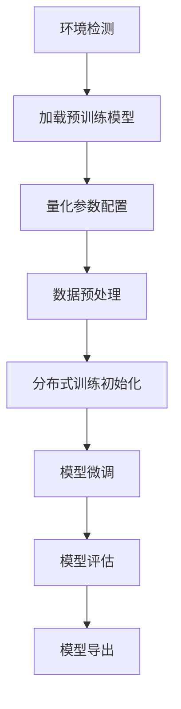
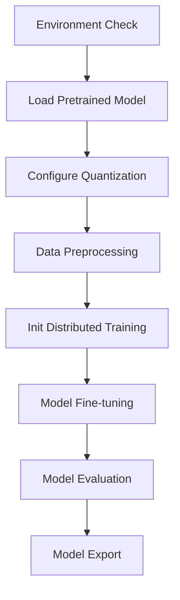

# 大模型微调平台

这是一个可扩展的大模型微调平台，支持模型下载、数据集管理、环境检测和微调配置等功能。

## 功能特点

- **模型管理**：支持从HuggingFace下载模型或指定本地模型路径
- **数据集管理**：支持从HuggingFace下载数据集或使用本地数据
- **环境检测**：验证当前机器是否满足微调要求
- **微调配置**：提供参数设置界面
- **训练监控**：展示微调过程和结果

## 安装与使用

### 安装依赖

```bash
pip install -r requirements.txt
```

### 启动平台

```bash
python app.py
```

## 项目介绍

### 中文版

**大模型微调平台**是一个基于Python/Flask构建的Web应用程序，支持大型语言模型的微调与管理。系统整合了Hugging Face生态、PyTorch训练框架和量化训练技术，提供从环境检测到模型部署的全流程解决方案。

#### 技术架构
- **核心框架**: Python 3.10 + Flask Web框架
- **深度学习**: 
  - PyTorch 2.0分布式训练原理：基于NCCL通信库实现数据并行，通过DistributedDataParallel封装，支持多机多卡训练
  - Unsloth量化机制：采用bitsandbytes库实现4-bit量化，通过QLoRA技术微调低秩适配矩阵
  - Transformers库集成HuggingFace生态
- **量化训练**: 
  - 8-bit量化：使用LLM.int8()线性层量化
  - 4-bit LoRA：结合NF4数据类型和双量化技术
  - FP16混合精度：通过AMP自动混合精度实现
- **分布式训练**: 
  - 多GPU数据并行：基于PyTorch DDP实现
  - DeepSpeed集成：支持ZeRO-3优化器状态切分
  - 弹性训练：支持节点动态扩缩容
- **前端界面**: 
  - Jinja2模板引擎实现动态渲染
  - Bootstrap 5响应式布局适配多端

#### 训练流程


#### 功能模块
1. **环境检测系统**：实时监测GPU显存、CUDA版本、Python依赖和磁盘空间
2. **模型管理中心**：
   - Hugging Face模型仓库集成
   - 本地模型加载/卸载
   - 量化参数配置(8bit/4bit)
   - 模型结构可视化
3. **数据集管理系统**：
   - 多格式数据集加载(csv/jsonl)
   - 数据预处理管道
   - 文本长度统计分析
4. **智能训练系统**：
   - LoRA微调配置
   - 学习率调度器(cosine/linear)
   - 训练过程实时监控
   - 损失/准确率可视化

#### 界面组成
1. **环境检测看板**：
   - 实时显示GPU利用率、显存占用、CPU负载
   - 依赖版本矩阵可视化
   - 磁盘空间环形图表
2. **模型管理界面**：
   - HuggingFace模型搜索/预览面板
   - 量化参数三维调节控件
   - 模型结构图可视化
3. **数据集分析界面**：
   - 文本长度分布直方图
   - 数据样本交互式预览
   - 特征统计多维分析
4. **训练监控中心**：
   - 实时损失/准确率曲线
   - GPU利用率波动图
   - 梯度流动画演示
5. **告警通知系统**：
   - 异常检测弹窗
   - 训练中断自动诊断
   - 资源不足预警系统

#### 发展规划
1. **多框架支持**：2024Q3 集成TensorFlow/PaddlePaddle
2. **自动化系统**：2024Q4 实现AutoML超参搜索
3. **可视化增强**：2025Q1 开发模型压缩3D可视化工具
4. **分布式扩展**：2025Q2 构建K8s训练集群管理系统
5. **性能优化**：2025Q3 集成TRT-LLM推理加速
6. **生态集成**：2025Q4 支持Colab/JupyterLab插件
7. **安全增强**：2026Q1 增加模型水印和权限管理

### English Version

**Large Model Fine-tuning Platform** is a web application built with Python/Flask for managing and fine-tuning large language models. The system integrates Hugging Face ecosystem, PyTorch training framework and quantization techniques, providing end-to-end solutions from environment setup to model deployment.

#### Technical Architecture
- **Core Framework**: Python 3.10 + Flask Web Framework
- **Deep Learning**:
  - PyTorch Distributed Training: Implements data parallelism via NCCL, wrapped with DistributedDataParallel
  - Unsloth Quantization: 4-bit NF4 quantization with double quantization using bitsandbytes
  - Transformers integration with HuggingFace ecosystem
- **Quantization**:
  - 8-bit: LLM.int8() for linear layers
  - 4-bit LoRA: QLoRA with nested quantization
  - FP16: Automatic Mixed Precision (AMP)
- **Distributed Training**:
  - Multi-GPU Data Parallel: PyTorch DDP implementation
  - DeepSpeed Integration: ZeRO-3 optimizer state partitioning
  - Elastic Training: Dynamic node scaling
- **Frontend**:
  - Jinja2 template engine
  - Bootstrap 5 responsive design

#### Training Workflow


#### Glossary
| 中文术语 | English Term |
|----------|--------------|
| 量化训练 | Quantization Training |
| 低秩适配 | Low-Rank Adaptation |
| 混合精度 | Mixed Precision |
| 分布式数据并行 | Distributed Data Parallel |

#### Features
1. **Environment Diagnostics**:
   - Real-time GPU/CUDA monitoring
   - Dependency version matrix
   - Disk space ring chart
2. **Model Management**:
   - HuggingFace model search/preview
   - 3D quantization controls
   - Architecture visualization
3. **Dataset Analytics**:
   - Text length histogram
   - Interactive sample preview
   - Feature statistics dashboard
4. **Training System**:
   - Real-time loss/accuracy curves
   - GPU utilization monitor
   - Gradient flow animation
5. **Alert System**:
   - Exception detection popup
   - Automatic failure diagnosis
   - Resource shortage预警

#### Roadmap
1. Multi-framework support
2. AutoML integration
3. Model compression toolkit
4. Distributed training

## 项目结构

```
├── app.py                  # 主应用入口
├── requirements.txt        # 项目依赖
├── config/                 # 配置文件
├── modules/                # 功能模块
│   ├── model_manager.py    # 模型管理模块
│   ├── dataset_manager.py  # 数据集管理模块
│   ├── env_checker.py      # 环境检测模块
│   ├── training_config.py  # 微调配置模块
│   └── training_monitor.py # 训练监控模块
├── ui/                     # 用户界面
│   ├── main_window.py      # 主窗口
│   └── components/         # UI组件
└── utils/                  # 工具函数
```